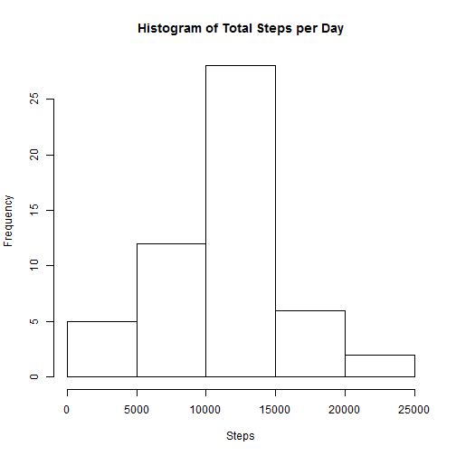
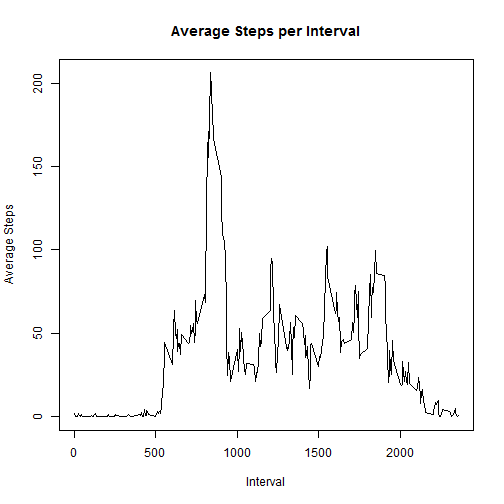
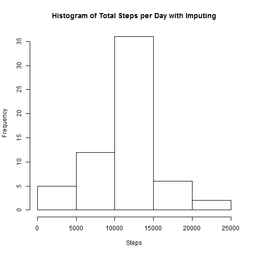
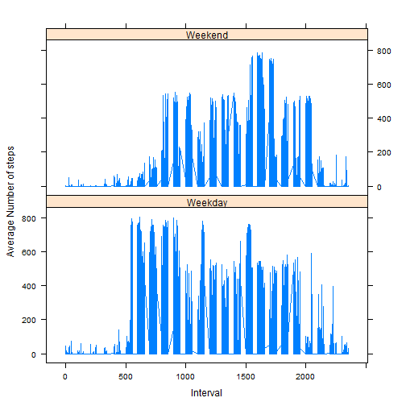

This file contains the R code chunks and the respective output for Peer Assessment 1, Reproducible research.

---
#Loading and Processing the Data:

Here is a sample of the data. 


```r
dat <- read.csv("activity.csv")

head(dat)
```

```
##   steps       date interval
## 1    NA 2012-10-01        0
## 2    NA 2012-10-01        5
## 3    NA 2012-10-01       10
## 4    NA 2012-10-01       15
## 5    NA 2012-10-01       20
## 6    NA 2012-10-01       25
```


#What is the mean total number of steps taken per day?


```r
dat2 <- na.omit(dat)

sum_steps <- sum(dat2[,"steps"])
```

      The total number of steps take is 570608.


```r
total_steps_per_day <- aggregate(dat2$steps, by = list(date = as.Date(dat2$date)), FUN=sum)


hist(total_steps_per_day$x, main = "Histogram of Total Steps per Day", xlab = "Steps")
```

 

```r
mean_steps_per_day <- format(mean(total_steps_per_day$x), digits = 2)

median_steps_per_day <- median(total_steps_per_day$x)
```

      The mean steps per day is 10766.
      
      The median steps per day is 10765.
     
     
#What is the average daily activity pattern?

A plot of the 5 minute intervals
        

```r
mean_steps_per_interval <- aggregate(dat2$steps, by = list(interval = dat2$interval), FUN=mean)

plot(mean_steps_per_interval, type="l", main= "Average Steps per Interval", ylab = "Average Steps", xlab="Interval")
```

 


```r
mspi <- mean_steps_per_interval$interval[mean_steps_per_interval$x==max(mean_steps_per_interval$x)]
```

      The interval with the highest average steps is 835.

# Imputing Missing Values


```r
total_NAs <- sum(is.na(dat$steps))
```
        
      The total number of "NA" values is 2304.


```r
dat3 <- merge(dat, mean_steps_per_interval)


dat3$steps <- ifelse(is.na(dat3$steps),dat3$x, dat3$steps)
```
      

```r
dat3 <- merge(dat, mean_steps_per_interval)


dat3$steps <- ifelse(is.na(dat3$steps),dat3$x, dat3$steps)

new_tspd <- aggregate(dat3$steps, by = list(date = as.Date(dat3$date)), FUN=sum)

hist(new_tspd$x, main = "Histogram of Total Steps per Day with Imputing", xlab = "Steps")
```

 

```r
new_mean <- format(mean(new_tspd$x), digits = 2)

new_median <- format(median(new_tspd$x), digits = 2)
```


      The mean steps per day is 10766.
      
      The median steps per day is 10766.
      
      Using imputed values sets the mean and the median equal to each other.
      
      
# Are there differences in activity patterns between weekdays and weekends?


```r
dat3$dayofweek <- c(weekdays(as.Date(dat3$date)))

dat3$weekend_weekday <- ifelse(dat3$dayofweek %in% c("Saturday", "Sunday"), "Weekend", "Weekday")

wd_mspi <- aggregate(dat3$steps, by = list(interval = dat3$interval, part_of_week = dat3$weekend_weekday), FUN=mean)

library(lattice)

xyplot(x ~ interval| part_of_week, data = wd_mspi, type = "l", xlab = "Interval", ylab = "Average Number of steps", layout=c(1,2))
```

 


